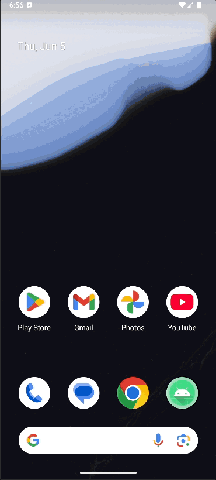
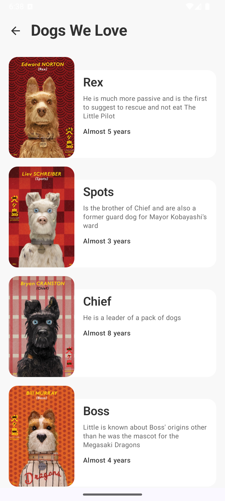
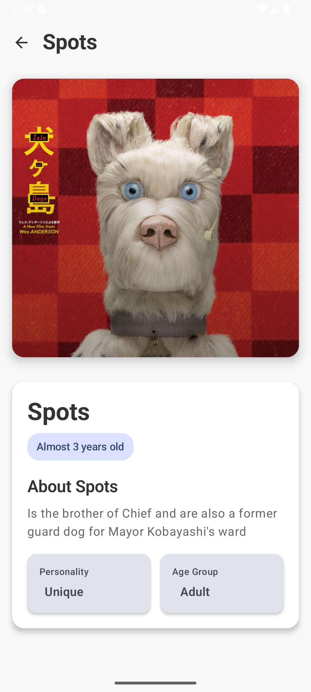
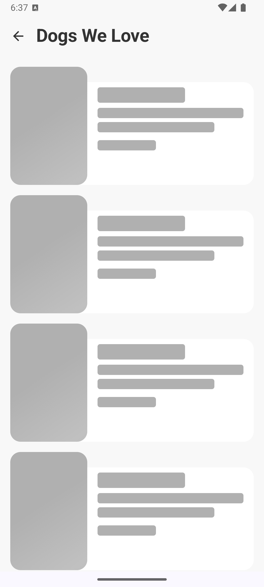

# Dogs App 🐕

Una aplicación Android desarrollada con Jetpack Compose que muestra una lista de perros y permite
ver los detalles de cada uno. La app implementa arquitectura MVVM con Clean Architecture, navegación
entre pantallas y manejo de estados.

## 🎥 Demo de la Aplicación

### Video Demostrativo



El video muestra:

- **Navegación completa** entre pantallas
- **Estados de carga** con shimmer effect
- **Animaciones compartidas** fluidas
- **Manejo de errores** y reintentos
- **UI responsiva** y moderna

### Capturas de Pantalla

|        Lista de Perros        |         Detalle del Perro          |          Estados de Carga           |
|:-----------------------------:|:----------------------------------:|:-----------------------------------:|
|  |  |  |

---

## 📋 Funcionalidades Implementadas

### ✅ Funcionalidades Principales

- **Lista de Perros**: Pantalla principal que muestra todos los perros disponibles
- **Detalle del Perro**: Pantalla de detalle con información completa del perro seleccionado
- **Navegación**: Navegación fluida entre pantallas con animaciones compartidas
- **Estados de UI**: Manejo de estados de carga, error y datos exitosos
- **Reintentos**: Botón de reintento en caso de errores de carga

### ✅ Características Técnicas

- **Arquitectura MVVM + Clean Architecture**
- **Inyección de Dependencias** con Dagger Hilt
- **Base de Datos Local** con Room
- **Networking** con Retrofit + Moshi
- **UI Moderna** con Jetpack Compose
- **Animaciones Compartidas** entre pantallas
- **Manejo de Estados** reactivo
- **Testing** unitario e instrumentado

## 🏗️ Decisiones Técnicas

### Arquitectura

- **Clean Architecture**: Separación clara entre capas (Presentation, Domain, Data)
- **MVVM Pattern**: ViewModels para manejo de estado y lógica de presentación
- **Repository Pattern**: Abstracción de fuentes de datos (local/remoto)
- **Use Cases**: Encapsulación de lógica de negocio

### Stack Tecnológico

- **Jetpack Compose**: UI declarativa moderna
- **Navigation Compose**: Navegación type-safe con serialización
- **Dagger Hilt**: Inyección de dependencias
- **Room**: Base de datos local con persistencia
- **Retrofit + Moshi**: Networking y serialización JSON
- **Coroutines + Flow**: Programación asíncrona reactiva
- **Material 3**: Design system moderno

### Estructura de Packages

```
com.gibran.dogsapp/
├── data/
│   ├── local/          # Room database, DAOs
│   ├── model/          # Modelos de api
│   ├── remote/         # Retrofit API interfaces
│   └── repository/     # Implementación de repositorios
├── di/                 # Módulos de Dagger Hilt
├── domain/
│   ├── model/          # Modelos de dominio
│   ├── repository/     # Interfaces de repositorio
│   └── usecase/        # Casos de uso
└── presentation/
    ├── navigation/     # Configuración de navegación
    ├── state/          # Estados de UI
    ├── event/          # Eventos de UI
    ├── ui/             # Pantallas Compose
    ├── viewmodel/      # ViewModels
    └── theme/          # Tema y estilos
```

## 🚀 Cómo Correr el Proyecto

### Prerrequisitos

- Android Studio Hedgehog | 2023.1.1 o superior
- JDK 17
- Android SDK API 34
- Dispositivo físico o emulador con Android 7.0+ (API 24)

### Pasos para Ejecutar

1. **Clonar el repositorio**
   ```bash
   git clone [URL_DEL_REPO]
   cd DogsApp
   ```

2. **Abrir en Android Studio**
    - File → Open → Seleccionar la carpeta del proyecto

3. **Sincronizar dependencias**
    - Android Studio sincronizará automáticamente
    - O ejecutar: `./gradlew build`

4. **Ejecutar la aplicación**
    - Conectar dispositivo o iniciar emulador
    - Presionar "Run" o usar `Shift + F10`

### Comandos Útiles

```bash
# Limpiar y compilar
./gradlew clean build

# Ejecutar tests unitarios
./gradlew test

# Ejecutar tests instrumentados
./gradlew connectedAndroidTest

# Generar APK de debug
./gradlew assembleDebug
```

## 🧪 Testing

### Tests Implementados

- **Tests Unitarios**: ViewModels, Use Cases, Repositories
- **Tests de UI**: Pantallas individuales con Compose Testing
- **Tests de Navegación**: Flujos de navegación entre pantallas

### Ejecutar Tests

```bash
# Tests unitarios
./gradlew test

# Tests instrumentados (requiere dispositivo/emulador)
./gradlew connectedAndroidTest
```

## 📱 Screens y Navegación

### Lista de Perros (`DogListScreen`)

- Muestra grid de perros con imagen, nombre y descripción
- Estados de carga con shimmer effect
- Manejo de errores con opción de reintento
- Navegación al detalle al tocar un perro

### Detalle del Perro (`DogDetailScreen`)

- Información completa del perro seleccionado
- Imagen destacada con información de edad y personalidad
- Botón de regreso con navegación
- Animaciones compartidas desde la lista

## 🔄 Estados de la Aplicación

### DogListUiState

```kotlin
data class DogListUiState(
    val dogs: List<Dog> = emptyList(),
    val isLoading: Boolean = false,
    val errorMessage: String? = null
)
```

### Manejo de Estados

- **Loading**: Muestra shimmer cards mientras carga
- **Success**: Muestra la lista de perros
- **Error**: Muestra mensaje de error con botón de reintento

## 🎨 Diseño y UX

### Material 3 Design

- Colores y tipografía siguiendo Material You
- Componentes consistentes y accesibles
- Modo claro con posibilidad de extensión a modo oscuro

### Animaciones

- Shared Element Transitions entre pantallas
- Animaciones suaves y naturales
- Feedback visual en interacciones

## 📝 Notas Adicionales

### Elecciones de Diseño

1. **Type-Safe Navigation**: Uso de Navigation Compose con serialización para navegación segura
2. **Single Activity**: Arquitectura de una sola Activity con Compose
3. **Reactive UI**: Estados reactivos con StateFlow y Compose State
4. **Error Recovery**: UX centrada en recuperación de errores

### Consideraciones de Performance

- **Lazy Loading**: LazyVerticalGrid para listas eficientes
- **Image Caching**: Coil para carga y cache optimizado de imágenes
- **State Management**: Estados locales vs globales optimizados

### Decisiones de Testing

- **Testing Strategy**: Pirámide de testing con énfasis en tests unitarios
- **UI Testing**: Tests de componentes individuales vs flows completos
- **Mock Strategy**: Mocking de dependencias externas

### Estructura de Datos

```kotlin
data class Dog(
    val id: Int,
    val name: String,
    val description: String,
    val age: Int,
    val imageUrl: String
)
```

## 🔧 Dependencias Principales

| Dependencia | Versión | Propósito |
|------------|---------|-----------|
| Compose BOM | 2025.06.00 | UI declarativa |
| Hilt | 2.55 | Inyección de dependencias |
| Room | 2.7.1 | Base de datos local |
| Retrofit | 2.11.0 | Cliente HTTP |
| Moshi | 1.15.1 | Serialización JSON |
| Navigation | 2.9.0 | Navegación |
| Coil | 2.7.0 | Carga de imágenes |

## 📄 Licencia

Este proyecto está desarrollado como una aplicación de demostración técnica.

---
## 👨‍💻 Autor

**Gibran Reyes** – [LinkedIn](https://www.linkedin.com/in/gibranreyes)

**Desarrollado con ❤️ usando Jetpack Compose y Clean Architecture**
